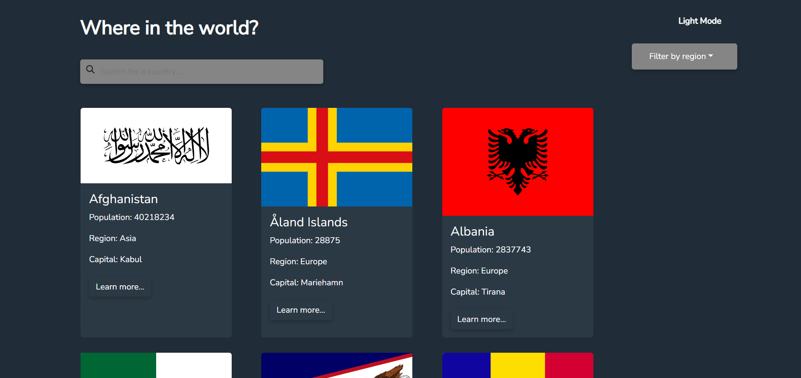

# Web REST Countries App

Welcome to the Web REST Countries app! This web application allows you to explore information about countries around the world using the REST Countries API. The app is built using React and makes use of various features to enhance your experience. Whether you're looking for basic country information or more detailed insights, this app has got you covered.



## Features

### 1. View All Countries

On the homepage of the app, you will find a list of all countries retrieved from the REST Countries API. Each country is represented by a card displaying its name, flag, population, region, and capital.

### 2. Search for a Country

The app provides a convenient `input` field that allows you to search for a specific country. As you type, the list of countries will dynamically update to display only those that match your search query.

### 3. Filter by Region

You can also filter countries by region using the region selection dropdown. This helps you narrow down your exploration to countries belonging to a particular geographic region.

### 4. Detailed Information

Clicking on a country's card will take you to a separate page that displays more detailed information about the selected country. This includes data such as population, area, languages spoken, currencies used, and more.

### 5. Bordering Countries

While viewing detailed information about a specific country, you will find a list of its bordering countries. Clicking on any of these border countries will take you to their detailed information page, allowing you to seamlessly navigate between countries.

### 6. Color Scheme Toggle (Optional)

For your viewing comfort, the app provides an optional feature to toggle between light and dark modes. This can be particularly useful when using the app in different lighting environments.

## Installation

1. Clone this repository to your local machine using:

   ```
   git clone https://github.com/jatinkumarverma/web-rest-countries-app.git
   ```

2. Navigate to the project directory:

   ```
   cd web-rest-countries-app
   ```

3. Install the dependencies using your preferred package manager. For example, if you're using npm:

   ```
   npm install
   ```

4. Start the development server:

   ```
   npm start
   ```

5. Open your web browser and go to `http://localhost:3000` to access the app.

## Credits

- This app was built using React. Learn more about React [here](https://reactjs.org/).
- Country data is retrieved from the REST Countries API. Check out the API documentation [here](https://restcountries.com/).
- Dark mode functionality was implemented using [insert dark mode library name here].

## Feedback and Contributions

Your feedback is valuable! If you encounter any issues, have suggestions for improvements, or want to contribute to the project, please feel free to create issues or submit pull requests in this repository.

Enjoy exploring the diverse world of countries using the Web REST Countries app!
